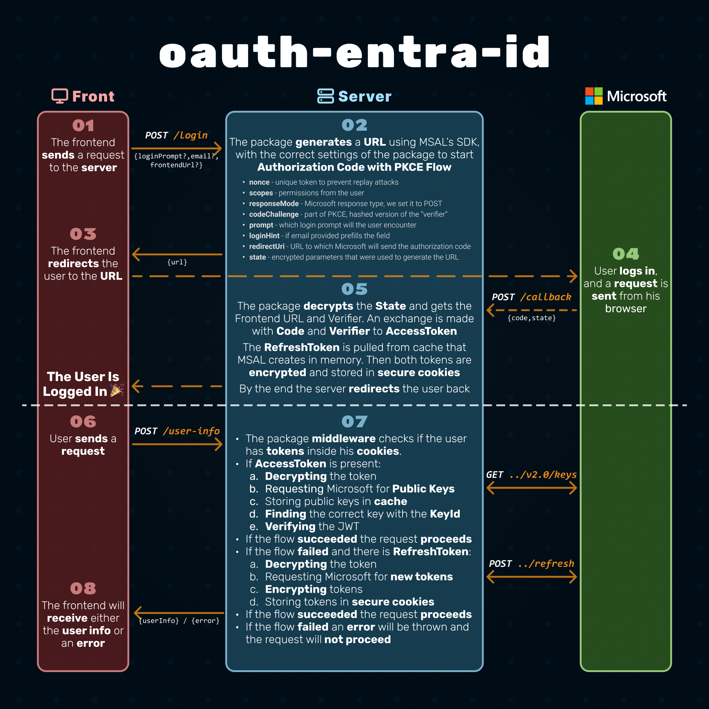

# OAuth Entra ID [(npm)](https://www.npmjs.com/package/oauth-entra-id)

## Overview 🪟

`oauth-entra-id` is a framework-agnostic package that provides a secure and simple way to implement OAuth 2.0 authentication and authorization with Microsoft Entra ID (formerly Azure AD). It abstracts away the complexity of OAuth 2.0, allowing developers to focus on building their applications without worrying about the underlying authentication and authorization mechanisms.

## Installation 🚀

```bash
npm install oauth-entra-id
```

## Features 📦

- 🔐 Secure backend-driven OAuth 2.0 Authorization Code Grant flow with PKCE (Proof Key for Code Exchange).
- 🍪 Cookie-based authentication.
- 🔄️ Access token and refresh token management and rotation.
- ✅ Built-in validation for Microsoft-issued JWTs using Entra ID public keys.
- 📢 Supports B2B authentication and OBO (On-Behalf-Of) flow.

  **For further reading, check out the [documentation](packages/oauth-entra-id/README.md). 💯**

## Demo Apps 👀

You can explore the demo apps to see how to integrate the package into your applications.

- [React Demo App](demos/client-react/) 🖥️ - React 19 frontend showcasing best practices for frontend integration in an OAuth 2.0 cookie-based flow.

  > React 19, TanStack Router, TanStack Query (React Query), TanStack Form, Zustand, Tailwind, ShadCN Components, Axios and Zod.

- [Express Demo App](demos/server-express/) 📫- Express server, implements `oauth-entra-id/express` for authentication.
- [NestJS Demo App](demos/server-nestjs/) 🪺 - NestJS server, implements `oauth-entra-id/nestjs` for authentication.
- [HonoJS Demo App](demos/server-honojs/) 🔥 - HonoJS server, implements authentication using the core utilities of the package.
- [Fastify Demo App](demos/server-fastify/) ⚡ - Fastify server, implements authentication using the core utilities of the package.

> In each server demo you get a fully working server with the following features:
>
> - Auth flows and protected routes.
> - User input validation.
> - Environment variables handling.
> - HTTP security headers and CORS setup with credentials.
> - Rate limiting.
> - Logging.
> - Centralized error handling

## Architecture 🏗️



## How to Run the Project Locally 🚀

### _Setup_ 🛠️

Make sure you have [Node.js](https://nodejs.org/) installed on your machine.

The project uses [PNPM](https://pnpm.io/) as the package manager. PNPM can be installed by running:

```bash
npm install -g pnpm
```

Then you can install the dependencies:

```bash
pnpm install
```

You will need to set up environment variables in several places:

- `.env`
- `apps/client-react/.env`
